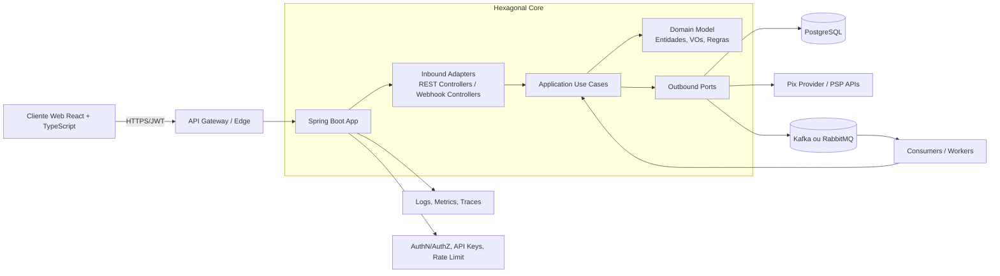
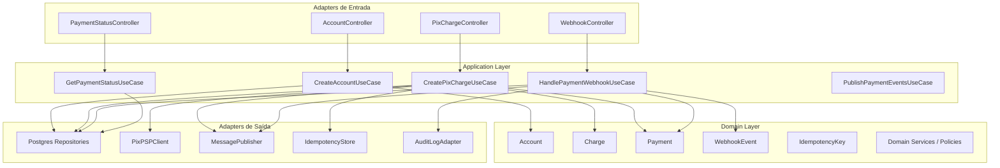
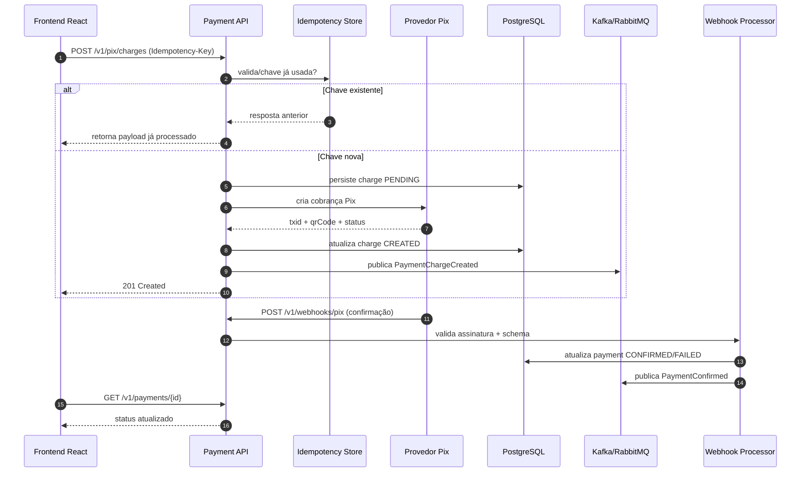

# IronVault 2.0 — Arquitetura Inicial (Pix Auto-Pagamentos)

## 1) Visão de alto nível

Plataforma de pagamentos com foco em **Pix**, construída para alto volume e resiliente a falhas, adotando:

- **Backend:** Java 21 + Spring Boot (arquitetura hexagonal + Clean Architecture)
- **Frontend:** React + TypeScript (BFF-ready, desacoplado por services/hooks)
- **Banco:** PostgreSQL
- **Mensageria:** Kafka (preferencial para alto throughput) ou RabbitMQ (alternativa)
- **Infra futura:** Docker + AWS

## 2) Princípios arquiteturais

1. **Hexagonal (Ports and Adapters):**
   - Domain não depende de frameworks.
   - Application coordena casos de uso.
   - Infrastructure implementa adapters de entrada/saída.
2. **Clean Architecture:**
   - Dependências sempre para dentro (infrastructure -> application -> domain).
3. **Eventos assíncronos como pilar:**
   - Operações críticas disparam eventos de domínio e integração.
4. **Observabilidade e segurança by design:**
   - Logs estruturados + tracing + métricas + auditoria.

## 3) Diagrama de arquitetura (backend + frontend)



## 4) Diagrama de componentes (backend)



## 5) Fluxo completo de pagamento Pix



## 6) Estrutura sugerida do backend (multi-módulo)

```text
ironvault-payments/
  backend/
    pom.xml (parent)
    iv-domain/
      model/
      valueobject/
      service/
      event/
      exception/
    iv-application/
      usecase/
      port/in/
      port/out/
      dto/
      mapper/
      command/
      query/
    iv-infrastructure/
      adapter/in/rest/
      adapter/in/webhook/
      adapter/out/persistence/postgres/
      adapter/out/messaging/kafka/   (ou rabbitmq/)
      adapter/out/pixprovider/
      adapter/out/security/
      config/
    iv-boot/
      Application.java
      application.yml
```

### Responsabilidades por módulo

- **iv-domain**
  - Regras de negócio puras (ex.: transição de status do pagamento).
  - Eventos de domínio (PaymentCreated, PaymentConfirmed).
- **iv-application**
  - Orquestra casos de uso.
  - Define portas de entrada/saída.
  - Aplica políticas transacionais.
- **iv-infrastructure**
  - Implementa adapters técnicos (DB, mensageria, PSP, segurança).
- **iv-boot**
  - Wiring Spring Boot, configuração e bootstrap.

## 7) Serviços principais e responsabilidades

1. **Account Service**
   - Criação/gestão de contas de merchants.
   - Emissão e rotação de API Keys.
2. **Pix Charge Service**
   - Criação de cobrança, txid, QR Code/EMV.
   - Persistência e publicação de evento de cobrança criada.
3. **Payment Orchestrator**
   - Coordena estado da transação e consistência eventual.
4. **Webhook Ingestion Service**
   - Verifica assinatura/origem, deduplica eventos e atualiza status.
5. **Payment Status Service**
   - Consulta consolidada de status por paymentId/txid.
6. **Notification/Event Service**
   - Entrega eventos a outros domínios internos/externos.

## 8) Organização do frontend (React + TypeScript)

```text
frontend/
  src/
    app/
      router/
      store/
      providers/
    pages/
      Dashboard/
      Accounts/
      Charges/
      PaymentDetails/
      WebhookLogs/
    components/
      forms/
      tables/
      status/
      layout/
    services/
      apiClient.ts
      authService.ts
      accountService.ts
      pixChargeService.ts
      paymentService.ts
      webhookService.ts
    hooks/
      useAuth.ts
      useCreatePixCharge.ts
      usePaymentStatus.ts
      useWebhookEvents.ts
    types/
      api/
      domain/
    utils/
      formatters/
      validators/
```

### Diretrizes de frontend

- **Camada services** centraliza chamadas HTTP e versionamento de endpoint.
- **Hooks** encapsulam estados de loading/error/retry.
- **Pages** orquestram UX, sem lógica de integração dispersa.
- **Componentes** reusáveis e sem acoplamento ao backend.

## 9) Estratégia de idempotência (evitar pagamentos duplicados)

1. Cliente envia `Idempotency-Key` por request crítica (criação de cobrança).
2. Backend calcula **fingerprint do payload** (hash canônico).
3. Armazena em tabela/cache:
   - chave,
   - fingerprint,
   - status de processamento,
   - resposta serializada,
   - TTL.
4. Requisição repetida:
   - mesma chave + mesmo fingerprint -> retorna resposta anterior.
   - mesma chave + fingerprint diferente -> `409 Conflict`.
5. Webhooks também idempotentes por `eventId/txid` + janela temporal.

## 10) Retry, falhas e DLQ

- **Retry exponencial com jitter** em integrações externas (PSP e mensageria).
- **Circuit breaker + timeout + bulkhead** para proteger recursos.
- **Outbox pattern** para garantir entrega de eventos após commit transacional.
- **DLQ** para mensagens que excederam tentativas:
  - armazenar payload + erro + stacktrace resumida + timestamp,
  - dashboard operacional para reprocessamento manual/automático.
- **Poison message handling** com validação de schema antes do processamento.

## 11) Versionamento de API

- Versão no path: `/api/v1/...`.
- Contratos versionados por OpenAPI.
- Política de depreciação com janela definida (ex.: 6 meses).
- Mudanças breaking apenas em `/v2`.
- Webhooks também versionados (`/webhooks/v1/pix`).

## 12) Segurança (API Key, JWT, autenticação)

1. **API Keys** (machine-to-machine)
   - Chave pública identificadora + segredo hash no banco.
   - Escopos por merchant (`charge:create`, `payment:read`).
   - Rotação periódica e revogação imediata.
2. **JWT/OAuth2** (usuários dashboard)
   - Access token curto + refresh token seguro.
   - Claims mínimas e assinatura forte (RS256/ES256).
3. **Webhook Security**
   - HMAC signature + timestamp + nonce.
   - Bloqueio de replay attack por janela curta.
4. **Criptografia e compliance**
   - TLS 1.2+ em trânsito.
   - Secrets em cofre (AWS Secrets Manager futuramente).
   - Dados sensíveis com criptografia em repouso.
5. **Hardening de API**
   - Rate limit por API key/IP.
   - WAF na borda.
   - Auditoria imutável de operações financeiras.

## 13) Escalabilidade e resiliência (alto volume)

- Serviços stateless para scale-out horizontal.
- Particionamento por `merchantId`/`paymentId` em tópicos Kafka.
- Read replicas para consultas de status intensivas.
- Cache seletivo para consultas quentes.
- Sagas/coreografia para processos longos.
- SLOs e alertas (latência, taxa de erro, backlog de filas, tempo de confirmação Pix).

## 14) Próximos passos sugeridos

1. Definir contratos OpenAPI v1 (accounts, charges, payments, webhooks).
2. Formalizar modelo de domínio (agregados e regras de transição de status).
3. Implementar POC do fluxo crítico: `CreatePixCharge` + `WebhookConfirm`.
4. Adicionar observabilidade mínima: correlation-id, tracing, dashboards.
5. Preparar pipelines CI/CD e baseline Docker para evolução AWS.
